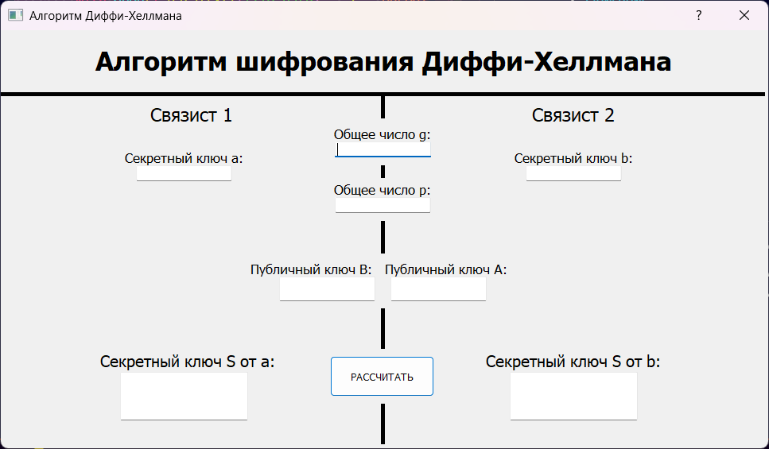

# CryptoApp - пособие по криптографии


## Содержание
- [Описание](#описание)
- [Функционал](#основные-функции)
- [Установка](#установка)
- [Структура](#структура-проекта)
- [Технологии](#технологии)
- [Поддерживаемые языки](#поддерживаемые-языки)
- [Примечания](#примечания)
- [Скриншоты](#скриншоты)
- [Лицензия](#лицензия)

## Описание
CryptoApp — это приложение на Python с графическим интерфейсом для работы с криптографическими алгоритмами. Программа позволяет шифровать и дешифровать текст с использованием следующих методов:
1. Шифр Цезаря.
2. Шифр Виженера.
3. Алгоритм Диффи-Хеллмана.

## Основные функции
- **Шифрование и дешифрование текста**:  
  - Шифр Цезаря позволяет сдвигать символы текста на заданное количество позиций.  
  - Шифр Виженера использует ключевое слово для шифрования текста.
- **Генерация ключей для Диффи-Хеллмана**: Позволяет вычислять общие ключи между сторонами с использованием алгоритма Диффи-Хеллмана.


## Установка
1. Клонируйте репозиторий:
   ```bash
   git clone https://github.com/your-username/CryptoApp.git
   cd CryptoApp
   ```
2. Установите зависимости:
   ```bash
   pip install -r requirements.txt
   ```
   *(Убедитесь, что у вас установлен Python версии 3.8 или выше.)*

3. Запустите игру:
   ```bash
   python main.py
   ```
   

## Структура проекта
```
   main.py                          # Основная логика проекта
   data/
   ├── txt/                         # Описания программ
   │   ├── ceasar_info.txt
   │   ├── vigener_info.txt
   │   └── diffi_hellman_info.txt
   ├── ui/                          # Файлы интерфейса
   │   ├── form.ui
   │   ├── ceasar_mode.ui
   │   ├── vigener_mode.ui
   │   └── diffi-hellman_alg.ui
   requirements.txt                 # Зависимости Python
   README.md                        # Документация проекта
   ```

## Технологии
- Python 3.7+
- PyQt5

## Поддерживаемые языки
- Латиница (нижний и верхний регистр).
- Кириллица (нижний и верхний регистр).

## Примечания
- Файлы с описанием алгоритмов (`ceasar_info.txt`, `vigener_info.txt`, `diffi_hellman_info.txt`) используются для подсказок в приложении.
- Файлы интерфейса разработаны с помощью Qt Designer.

## Скриншоты




## Лицензия
Проект распространяется под лицензией MIT. Подробнее см. в файле `LICENSE`.